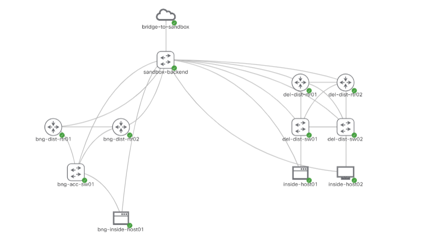

This post runs through the basics of Ansible for a beginner, and building a simple Ansible project that can test hostname compliance across devices in your network.

# What is Ansible?

Ansible is a handy IT automation tool, used heavily automating for DevOps and administrative jobs that need to be performed repeatedly at scale. According to [Ansible documentation](https://docs.ansible.com/ansible/latest/index.html), its main goals are simplicity and ease-of-use, coupled with security, reliability, and heavy use of SSH as a primary transport mechanism.

There are some core concepts to Ansible that need to be understood before it can be used to your needs.

1. Control node: This is a computer on which you run Ansible commands on to kick off Ansible workflows. **Ansible manages machines in an agent-less manner**, which means that all the software requirements and packages that are required to run automated tasks by Ansible on remote machines does not need to be installed on said remote machines. It only needs to be installed and set up on the control node.

2. Managed nodes: The machines that are managed by the automated workflows kicked off by Ansible. There are referred to as "hosts".

3. Inventory: The list of managed nodes that Ansible can manage from the control node. An inventory allows you to dictate host-specific information such as IP addresses, and also allocate hosts to groups based on some common characteristics. These groups come in handy when Ansible is required to run specific workflows against hosts with a common characteristic such as an operating system platform.

4. Modules: Ansible runs Python code underneath the hood, so a module can be seen as a unit of executable Python code that can be run in an ad-hoc fashion by Ansible.

5. Collections: A group of modules that are created by, or created for a common purpose (say, modules that automate actions on Cisco IOS devices) come under an umbrella called a collection. Collections make it easy for distribution of modules across the community, using [`ansible-galaxy`](https://galaxy.ansible.com/).

6. Tasks: A task is a unit of action in Ansible. It uses a module and can provide it contextual information to run some action in a workflow.

7. Playbooks: An ordered list of tasks forms a playbook. Roughly this is what I was referring to as a "workflow".

Ansible uses [YAML](https://yaml.org/) as the language in which you can write playbooks, and other components such as your inventory in as well.

# Creating an Ansible project

To kick off your Ansible project, create a project directory. **Ansible does not work on Windows machines, so if you work on Windows, get [WSL](https://docs.microsoft.com/en-us/windows/wsl/install-win10)**. Preferably, work within a virtual environment so that all installed Python packages are specific for the project and do not break dependencies for other projects.

To install the latest version of Ansible, `pip install ansible` should get you Ansible 2.10.5 as of today (February 2021).

By default, Ansible ships with a configuration file called `ansible.cfg`, located in the directory `/etc/ansible`. This configuration file tells Ansible where to look for Ansible specific pieces like inventory information, [Ansible roles](https://docs.ansible.com/ansible/latest/user_guide/playbooks_reuse_roles.html), and also sets some Ansible specific options, for example, to tell it not to perform SSH host key checking when connecting to a new device via SSH. A default config file can be found [here](https://github.com/ansible/ansible/blob/devel/examples/ansible.cfg).

In the project directory, create an `ansible.cfg` file, which by default expects an [INI format](https://en.wikipedia.org/wiki/INI_file) of configuration options. For our example this should be fine:

```ini
[defaults]

inventory            = ./inventory/
roles_path           = ./roles/
interpreter_python   = auto_silent
host_key_checking    = False
deprecation_warnings = False
```

So our configuration tells Ansible to search for inventory information in the inventory folder within the project, and roles in the roles folder within the project by default.

## The inventory

In my case, I have set up a small topology of 7 network devices (4 routers, 3 switches) in 2 logically separated networks (can consider 2 sites)



In the inventory folder, I created an inventory file called `inv.yml`. In this YAML file, we can describe host names and host specific variables, grouped under specific groups if need be. Ansible has a group called `all` by default, which is a parent group for all hosts and groups in the inventory.

As my topology has devices with 2 platforms (Cisco IOS and Cisco NX-OS), my hosts are partitioned into 2 groups. Within these groups I can specify my hosts and specify the host specific IP address that Ansible can reach the host at. So my inventory file `inv.yml` looks like this:

```yaml
ios:
  hosts:
    bng-dist-rtr01:
      ansible_host: 10.10.20.182
    bng-dist-rtr02:
      ansible_host: 10.10.20.183
    del-dist-rtr01:
      ansible_host: 10.10.20.175
    del-dist-rtr02:
      ansible_host: 10.10.20.176

nxos:
  hosts:
    bng-acc-sw01:
      ansible_host: 10.10.20.181
    del-dist-sw01:
      ansible_host: 10.10.20.177
    del-dist-sw02:
      ansible_host: 10.10.20.178
```

> NOTE: This is how I want my inventory to look like. The IP addresses are correct, but as this exercise is meant to check the hostname compliance of these devices, the actual on device names such as `bng-dist-rtr01` may not actually be the same as on the device.

As we can see, there are 2 groups: `ios` and `nxos`. These 2 groups have different operating systems on their hosts. Ansible provides special variables that it uses to interact with and know about the device it runs the playbook against. The variable `ansible_network_os` is one such variable, and it represents the operating system of the network device. Let us set that.

In the `inventory/` folder of the project, create a `group_vars/` folder. Inside this folder, create 2 files to represent the 2 groups created- `ios.yml` and `nxos.yml`. In the `ios.yml` file, the `ansible_network_os` variable can be set and controlled

```yaml
ansible_network_os: ios
```

and `nxos.yml` can have the same set as `ansible_network_os: nxos`.

To handle the SSH user and password that will be used by Ansible to connect to your devices, Ansible variables named `ansible_user` and `ansible_password` can be set either under the group vars files (if the credentials are platform specific), but if your credentials are globally the same, then probably keeping them in a file inside a folder named `all/`, that resides in the `inventory/group_vars/` folder created would be a good idea. Name that file `main.yml` for simplicity, and it sets the following variables:

```yaml
ansible_user: "{{ lookup('env', 'NETWORK_USER') }}"
ansible_password: "{{ lookup('env', 'NETWORK_PASSWORD') }}"
ansible_become_password: "{{ lookup('env', 'NETWORK_PASSWORD') }}"
```

A `lookup` plugin in Ansible is used to access data from outside sources. This comes in handy when dealing with sensitive data that is specific to yourself and not needed by other contributors or users of the project. Here, `lookup` is used to check the `env` variables (environment variables) in your shell environment. Make sure your SSH username and password is set on the shell you will be running Ansible from

```bash
export NETWORK_USER=<username>
export NETWORK_PASSWORD=<password>
```


And the inventory is ready! A good resource to refer to for building your first static inventory can be found [here](https://docs.ansible.com/ansible/latest/network/getting_started/first_inventory.html) from Ansible docs.

> NOTE: You may find it useful to execute `ansible-inventory --list` in the root of your Ansible project to see how Ansible sees your inventory based on how you have created it.

## The playbook

Compliance checks can be done in more complex ways than the manner by which I test for on my CML devices- rightfully so, as I do not want to bore you any more :-) In this example, I will just be checking if the hostname on the device is the same as the hostname in my Ansible inventory. Normally, hostname compliance would be checked by passing the hostname found on device through a [custom filter plugin](http://www.dasblinkenlichten.com/creating-ansible-filter-plugins/) that would perform RegEx pattern matches to see if the hostname follows the naming standards you expect it to.

In the root of your project, or in the `playbooks/` folder of your project, create a file that will be the playbook you run to do the compliance check across all your devices. Playbooks are YAML files, so it will have the suffix of `.yml`.

A playbook consists of multiple plays. Each play has some options that are required for the play to execute the tasks that are listed inside it. Ansible docs has listed the play specific variables that can be set for a play in a playbook [here](https://docs.ansible.com/ansible/latest/reference_appendices/playbooks_keywords.html#play).

In most cases, the playbook needs to know which hosts to run the play against, and what tasks it will run against those hosts. As we are running against network devices, a [connection plugin](https://docs.ansible.com/ansible/latest/plugins/connection.html) called [`network_cli`](https://docs.ansible.com/ansible/latest/collections/ansible/netcommon/network_cli_connection.html) needs to be set to tell Ansible that your playbook will be interacting with the CLI of network devices. Connection plugins allow Ansible to connect to the target hosts so it can execute tasks on them. `network_cli` uses [`paramiko`](https://www.paramiko.org/) as the transport library to talk to the network device via SSH.

To denote the start of a YAML file, the beginning of the file needs to include 3 dashed lines `---`. So by now, the playbook looks like this:

```yaml
---

- name: CHECK HOSTNAME COMPLIANCE OF ALL DEVICES
  hosts: all # This will change to separate IOS and NXOS plays in the same playbook, to allow easy use of ios_facts,nxos_facts
  connection: network_cli
  gather_facts: no # disable Ansible gather facts
```

Within this play, we can now define the tasks to be executed. To get the hostname that is configured on the device, we can use the modules [`ios_facts`](https://docs.ansible.com/ansible/latest/collections/cisco/ios/ios_facts_module.html) and [`nxos_facts`](https://docs.ansible.com/ansible/latest/collections/cisco/nxos/nxos_facts_module.html), provided to us as part of the IOS and NXOS Ansible collections, which are maintained on GitHub. These ship with Ansible itself, so we do not need to install anything extra- except for the requirements of these modules, and a package used when Ansible connects to devices using a username specific password instead of an SSH public key authentication login. Run the following commands to install those requirements:

```bash
pip install paramiko scp ansible-pylibssh
sudo apt-get install sshpass
```

Now our playbook should be straightforward, as it is a very simple check. The playbook will consist of 2 plays, each attacking IOS and NX-OS grouped hosts respectively (see how nice it is to set context through plays?). Looking at the docs for the modules [`ios_facts`](https://docs.ansible.com/ansible/latest/collections/cisco/ios/ios_facts_module.html) and [`nxos_facts`](https://docs.ansible.com/ansible/latest/collections/cisco/nxos/nxos_facts_module.html), we can see that the result of the module returns a back a dictionary, having a key called `ansible_net_hostname`, which is the same for both modules. This will give us the on-device hostname of the IOS/NX-OS device.

The playbook will be as below:

```yaml
---

- name: CHECK HOSTNAME COMPLIANCE OF IOS DEVICES
  hosts: ios
  connection: network_cli
  gather_facts: no

  tasks:
    - name: GET IOS FACTS ABOUT DEVICE
      ios_facts:
      register: facts # store the result from ios_facts as a variable called facts

    - name: SKIP THIS ONLY IF HOSTNAME IS COMPLIANT
      fail:
        msg: "{ { inventory_hostname } } is configured with a non-compliant hostname: { {facts.ansible_facts.ansible_net_hostname } }"
        when: facts.ansible_facts.ansible_net_hostname != inventory_hostname

- name: CHECK HOSTNAME COMPLIANCE OF NXOS DEVICES
  hosts: nxos
  connection: network_cli
  gather_facts: no

  tasks:
    - name: GET NXOS FACTS ABOUT DEVICE
      nxos_facts:
      register: facts

    - name: SKIP THIS ONLY IF HOSTNAME IS COMPLIANT
      fail:
        msg: " { {inventory_hostname } } is configured with a non-compliant hostname: { {facts.ansible_facts.ansible_net_hostname } }"
        when: facts.ansible_facts.ansible_net_hostname != inventory_hostname
```

> (Please remove the spaces in between the curly brace characters, GitHub pages does not display it properly. Follow [Jinja2 variable syntax](https://ttl255.com/jinja2-tutorial-part-1-introduction-and-variable-substitution/))

Here `inventory_hostname` is a variable (double parantheses is used as a Jinja template construct to denote the use of a variable in a string) whose value is the name of the host as seen by the inventory.

Upon execution, I get a result as such:

```bash
(venv) user@COMPUTER:~$ ansible-playbook playbooks/check_hostname_compliance.yml

PLAY [CHECK HOSTNAME COMPLIANCE OF IOS DEVICES] *********************************************************************************************************************************

TASK [GET IOS FACTS ABOUT DEVICE] ***********************************************************************************************************************************************
ok: [bng-dist-rtr01]
ok: [del-dist-rtr02]
ok: [bng-dist-rtr02]
ok: [del-dist-rtr01]

TASK [SKIP THIS ONLY IF HOSTNAME IS COMPLIANT] **********************************************************************************************************************************
skipping: [bng-dist-rtr01]
skipping: [bng-dist-rtr02]
skipping: [del-dist-rtr01]
fatal: [del-dist-rtr02]: FAILED! => {"changed": false, "msg": "del-dist-rtr02 is configured with a non-compliant hostname: dist-rtr02"}

PLAY [CHECK HOSTNAME COMPLIANCE OF NXOS DEVICES] ********************************************************************************************************************************

TASK [GET NXOS FACTS ABOUT DEVICE] **********************************************************************************************************************************************
ok: [del-dist-sw02]
ok: [bng-acc-sw01]
ok: [del-dist-sw01]

TASK [SKIP THIS ONLY IF HOSTNAME IS COMPLIANT] **********************************************************************************************************************************
skipping: [bng-acc-sw01]
fatal: [del-dist-sw01]: FAILED! => {"changed": false, "msg": "del-dist-sw01 is configured with a non-compliant hostname: dist-sw01"}
fatal: [del-dist-sw02]: FAILED! => {"changed": false, "msg": "del-dist-sw02 is configured with a non-compliant hostname: dist-sw02"}

PLAY RECAP **********************************************************************************************************************************************************************
bng-acc-sw01               : ok=1    changed=0    unreachable=0    failed=0    skipped=1    rescued=0    ignored=0
bng-dist-rtr01             : ok=1    changed=0    unreachable=0    failed=0    skipped=1    rescued=0    ignored=0
bng-dist-rtr02             : ok=1    changed=0    unreachable=0    failed=0    skipped=1    rescued=0    ignored=0
del-dist-rtr01             : ok=1    changed=0    unreachable=0    failed=0    skipped=1    rescued=0    ignored=0
del-dist-rtr02             : ok=1    changed=0    unreachable=0    failed=1    skipped=0    rescued=0    ignored=0
del-dist-sw01              : ok=1    changed=0    unreachable=0    failed=1    skipped=0    rescued=0    ignored=0
del-dist-sw02              : ok=1    changed=0    unreachable=0    failed=1    skipped=0    rescued=0    ignored=0

(venv) user@COMPUTER:~$
```
