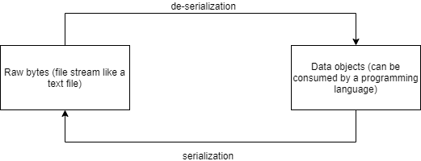

This post intends to shed light on how to programmatically consume information coming out of network devices.

# Data/Day-tuh/Dah-tah...?

If you a person who has tried to keep up with what technology is "trending", or more so what everyone seems to be talking about- tech or otherwise- they just don't shut up about data. What ranges from some binary bits in 0s and 1s stored on some piece of electronics in a datacenter, to complex visual representations on your screen is quite a complex being on its own.

Although, data is also pretty stupid on its own. Data in its raw form does not tell **how** it should be consumed. It is up to the regular human Joe to make something out of it. In the context of routers, switches, firewalls, whatever have you, this does not change much either. Engineers have to create solutions that can consume data from network devices.

# What is the challenge in consuming data from a network device?

The scope of what this note is talking about is how data from network devices can be consumed programmatically. A computer program does not understand the semantics of the expected data it needs to consume by itself. To give a simple example, here is a sample output from executing `show ip interface brief` on a Cisco router:

```
Router0# show ip interface brief

Interface              IP-Address      OK? Method Status                Protocol
GigabitEthernet0/0     192.168.1.254   YES manual up                    up
GigabitEthernet0/1     192.168.2.254   YES manual up                    up
GigabitEthernet0/2     unassigned      YES unset  administratively down down
```

Reading the information coming out of the output of this command on a Cisco router seems very straightforward to a human, right? But if a computer has to read this, it needs to understand that the statsuses `up` and `administratively down` are both values for the status an interface is in, even though one had one word whereas the other has multiple words. To show a different example, is the output of executing `show version` on a Cisco switch:

```
switch# show version
Cisco Nexus Operating System (NX-OS) Software
TAC support: http://www.cisco.com/tac
Copyright (c) 2002-2010, Cisco Systems, Inc. All rights reserved.
The copyrights to certain works contained herein are owned by
other third parties and are used and distributed under license.
Some parts of this software are covered under the GNU Public
License. A copy of the license is available at
http://www.gnu.org/licenses/gpl.html.

Software
BIOS: version 1.3.0
loader: version N/A
kickstart: version 5.0(2)N2(1) [build 5.0(2)N2(1)]
system: version 5.0(2)N2(1) [build 5.0(2)N2(1)]
power-seq: version v1.2
BIOS compile time: 09/08/09
kickstart image file is: bootflash:/sanity-kickstart
kickstart compile time: 12/6/2010 7:00:00 [12/06/2010 07:35:14]
system image file is: bootflash:/sanity-system
system compile time: 12/6/2010 7:00:00 [12/06/2010 08:56:45]

Hardware
cisco Nexus5010 Chassis ("20x10GE/Supervisor")
Intel(R) Celeron(R) M CPU with 2073416 kB of memory.
Processor Board ID JAF1228BTAS

Device name: TEST
bootflash: 1003520 kB

Kernel uptime is 0 day(s), 3 hour(s), 30 minute(s), 45 second(s)

Last reset
Reason: Unknown
System version:
Service:

plugin
Core Plugin, Ethernet Plugin, Fc Plugin
switch#
```

Here, while reading you can gather some information about the switch such as what software operating system it is running, what is the switch model name, uptime of the device, etc. But to programmatically grab this information, it is necessary to instruct the computer on how to read all this information.

# OK great- but what is the advantage of doing any of this programmatically?

Here is the thing about "programming": it has advanced from the days when it was used primarily for one off scripts. In today's climate, most time spent writing computer programs isn't to complete a local task (although you most certainly should do this to make your life easier), but the focus has shifted to building verbose software ecosystems that can solve multiple tasks in a domain and talk to other software applications to get stuff done.

At the very base of all this software building to get tasks done for your network is the vast expanse of data consumption from network devices. The translation of raw unstructured data to structured objects that can be understood by software without any confusion is called **de-serialization**, for which a more general term is *parsing*. The difference between the two is that de-serialization is purely used to transform serial data (from a file, which is a stream of bytes) to data objects in an object oriented programming language like Python, whereas parsing is more of a umbrella term that can be used outside the context of an object oriented programming language.



Similarly, the conversion of a programmable data object to a file stream is called *serialization*.

# Python data types

[Python](https://docs.python.org/3/) is a programming language that is heavily used in the network industry for progammability purposes. Understand how to use Python for your purposes [here](https://docs.python.org/3/tutorial/index.html).

It was initially adopted from the world of DevOps and has shown its usefulness across most applications of network progammability. There are many reasons why Python is so popular:

- It is an object oriented programming language. Python, like C++ and Java deals with data objects of various types and allows for inheritance patterns between user created and system created data classes
- Easy to learn syntax which allows you to describe rich data natively (such as mappings called dictionaries, lists, sets, etc.)
- Huge support of software modules which are easy to install and use in your software projects (thanks to package indices such as [pypi](https://pypi.org/))

to name a few. To understand how Python can work with data, it is necessary to understand the different data types provided natively in Python. Here are some that are used frequently in network programmability:

- Numbers: The most basic data types that represent numbers are the int (integer) data type that represent positive and negative integers (along with 0), and the float data type that represent positive and negative numbers that have a fractional part/decimal part (again, along with 0.0). Python also supports other number types in more verbose manners such as Decimal, Fraction, and complex numbers
```
x = 5 # x is an integer
y = 5.0 # y is a floating point number
```

- Strings: The string data type represents textual data. A string is enclosed within double or single quotes (`""` and `''`) and can hold numbers, textual characters, special characters
```
name = "John"
username = "john@123"
```
An interesting thing about strings is that they are **immutable** (like numbers)- which means once strings are assigned to an object (like `name` or `username` above), they cannot be manipulated in value. For instance, once the object `name` gets the value `"John"`, the letter "o" in John cannot be modified to the capital letter "O" in the same object. The object `x` can be reassigned, though. Read about immutability [here](https://docs.python.org/3/glossary.html#term-immutable)

- Lists: A list is a ordered collection of values of different data types. A list can consist of integers, strings, etc., including complex data types like dictionaries (described in the next item)
```
sample_list = [1,2,"three"]
```
As a list is ordered, a value in a list can be referenced to by an index. List indices start from 0 and go on till `n`, where `n = length of list - 1`.
So to get the value `2` in `sample_list`:
```
second_value = sample_list[1] # value with list index of 1
print(second_value) # prints 2
```
Lists are not immutable, and can be modified. Lists can also be manipulated by methods in Python, find those methods [here](https://www.w3schools.com/python/python_ref_list.asp).

- Dictionaries: A dictionary is a collection of **key value** pairs enclosed by curly braces (`{}`) and separated by commas (`,`). It can be considered a data type that creates a structure which allows for a mapping between keys and respective values to those keys. Dictionaries allow for the creating of richer data objects, such as one that could represent a person:
```
employee_dict = {
    "name": "John Doe",
    "employee_id": 123,
    "skills": ["Python", "Cisco Firepower", "Cisco ACI"],
    "address": {
        "street": "1st Street",
        "house_number": 123,
        "city": "Test City"
    }
}
```
To get the `employee_id` of this employee dictionary, it can be referenced by `employee_dict["employee_id"]`, which means "get me the value of the key `employee_id` in this dictionary".

A dictionary key has to be unique for that dictionary, and has to be of an immutable data type such as a string, integer, or any other immutable data type. The mapped value to these keys can be of any data type, even dict. Dictionaries can also be manipulated by methods in Python, find those methods [here](https://www.w3schools.com/python/python_ref_dictionary.asp).

# Parsing output from a network device to Python objects

There are multiple parsers available as of now that a network engineer could use to parse raw output thrown to us by a network device. Cisco actively maintains a testing suite called [PyATS](https://developer.cisco.com/docs/pyats/#!introduction/cisco-pyats-network-test--automation-solution), of which the [Genie parser](https://developer.cisco.com/docs/genie-docs/) is part. In this note, I will talk about using [TextFSM templates](https://github.com/google/textfsm/wiki) to parse output data from a Cisco switch.

TextFSM is a project built by Google that takes CLI string output and passes each line through a series of [regular expressions](https://docs.python.org/3/howto/regex.html) until it finds a match. The regular expressions use named capture groups to build a text table out of the significant text. The names of the capture groups are used as column headers, and the captured values are stored as rows in the table.

## RegEx

RegEx (Regular Expressions) are extremely useful in extracting specific information from textual data. Python provides a standard library `re` that allows developers to create regular expressions that can be used to search for patterns in a large piece of text data.

RegEx by itself is quite verbose of a topic; I would recommend using the following resources to understand RegEx:

- [Regular Expression HOWTO](https://docs.python.org/3/howto/regex.html)
- [Regex tutorial — A quick cheatsheet by examples](https://medium.com/factory-mind/regex-tutorial-a-simple-cheatsheet-by-examples-649dc1c3f285)

The second link is a good, quick cheatsheet to know which RegEx constructs to use for parsing your data.

## ntc-templates

[NTC Templates](https://github.com/networktocode/ntc-templates) is an open source GitHub repository consisting of TextFSM templates that can parse output data from various commands on multiple platforms across multiple vendors such as Cisco, Arista, Juniper, etc. It is an extremely useful resource for cross platform parsers which anybody can contribute to by submitting pull requests to their repository.

As an example to show how to use NTC templates, I shall parse the output of the `show fex` command on a Cisco Nexus 5000 series switch, which I shall source from a file called `show-fex` on my local setup.

### Step 1: Install the ntc-templates Python package/module

Using [pip](https://pip.pypa.io/en/stable/), it is easy to install ntc-templates from pypi by executing `pip install ntc_templates` in your bash shell.

### Step 2: Write file with output from Cisco device

As we are not connecting to the device using Python to get back the raw output (using Netmiko, Paramiko, etc...), we need to fetch the raw data from a file stream to get it in a consumable data object by de-serialization.

Create a file called `show-fex` in a directory of your choice, and have the raw output as shown below in the file (obtained from [Cisco documentation](https://www.cisco.com/c/m/en_us/techdoc/dc/reference/cli/nxos/commands/fex/show-fex.html) on `show fex`):

```
FEX FEX FEX FEX
Number Description State Model Serial
------------------------------------------------------------------------
100 FEX0100 Online N5K-C5110T-BF-1GE JAF1237ABSE
101 FEX0101 Online N2K-C2248TP-1GE JAF11223333
102 FEX0102 Online N5K-C5110T-BF-1GE JAF1241BLHQ
105 FEX0105 Online N2K-C2232P-10GE JAF1331AKBM
```

### Step 3: Read from file

Open the Python shell (ensure you have Python 3, I would recommend using [pyenv](https://github.com/pyenv/pyenv#installation) to make your life eaiser) and create a file object that will read from the file with the raw output.

```
(.venv) user@COMPUTER:~$ python
Python 3.7.9 (default, Jan  3 2021, 14:00:24)
[GCC 9.3.0] on linux
Type "help", "copyright", "credits" or "license" for more information.
>>> file_obj = open("show-fex", "r")
```

As TextFSM searches for patterns in textual data, we will need to use a file method called `read` to obtain a string type of data from the raw output file object.

```
>>> output = file_obj.read()
>>> output
'FEX FEX FEX FEX\nNumber Description State Model Serial\n------------------------------------------------------------------------\n100 FEX0100 Online N5K-C5110T-BF-1GE JAF1237ABSE\n101 FEX0101 Online N2K-C2248TP-1GE JAF11223333\n102 FEX0102 Online N5K-C5110T-BF-1GE JAF1241BLHQ\n105 FEX0105 Online N2K-C2232P-10GE JAF1331AKBM\n'
```

Here the `\n` character represents a new line character.

### Step 4: Parse list of raw lines

To allow the usage of the TextFSM template for parsing our raw output, we need to make sure the module is imported into our Python shell.

```
>>> from ntc_templates.parse import parse_output
```

Using this module, let us finally parse the raw data

```
>>> show_fex_parsed = parse_output(platform="cisco_nxos", command="show fex", data=output)
>>> from pprint import pprint
>>> pprint(show_fex_parsed)
[{'descr': 'FEX0100',
  'model': 'N5K-C5110T-BF-1GE',
  'number': '100',
  'serial': 'JAF1237ABSE',
  'state': 'Online'},
 {'descr': 'FEX0101',
  'model': 'N2K-C2248TP-1GE',
  'number': '101',
  'serial': 'JAF11223333',
  'state': 'Online'},
 {'descr': 'FEX0102',
  'model': 'N5K-C5110T-BF-1GE',
  'number': '102',
  'serial': 'JAF1241BLHQ',
  'state': 'Online'},
 {'descr': 'FEX0105',
  'model': 'N2K-C2232P-10GE',
  'number': '105',
  'serial': 'JAF1331AKBM',
  'state': 'Online'}]
```

Here, `pprint` is a module called pretty print that allows you to print a "better looking" version of your data (useful for printing dicts, in my opinion)

As we can see, we now have a list object that contains dictionary information about all the fabric extenders that are being used by the Cisco Nexus switch.

### Advantage of this data structure

From this list of dicts structure, we can see that every dictionary entry in the list has the same 4 keys: description, model, number, and state. This ensures uniformity of the data so that it can easily be consumed programmatically. For example, I can now create a list of all FEX numbers like this:

```
>>> outList = []
>>> for x in show_fex_parsed:
...     outList.append(x['number'])
...
>>> outList
['100', '101', '102', '105']
```

# Conclusion

Parsers look simple, they feel simple- yet, there is a lot that goes under the hood for more complex outputs. The advantage of using parsers in the context of network devices is immense. It allows you to create impactful and scalable solutions that give you insights into your network, and allow you to create a data driven programmatic interface that network engineers can interact with.
