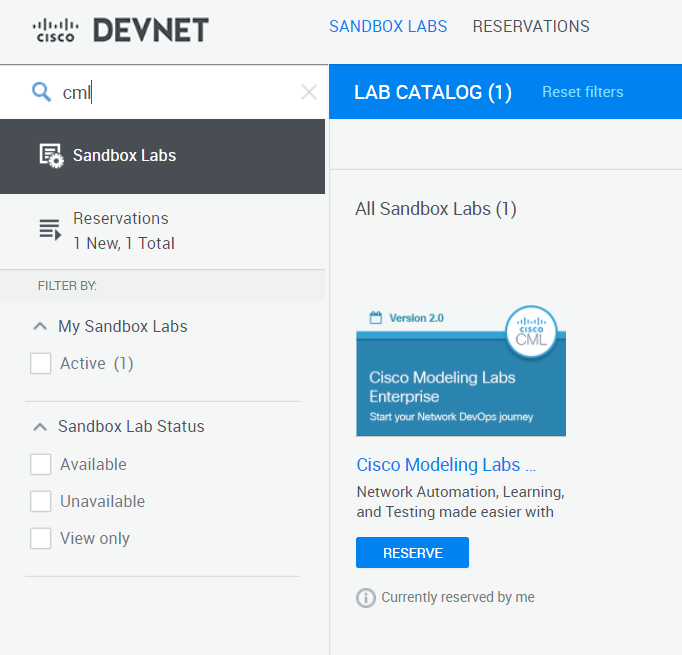
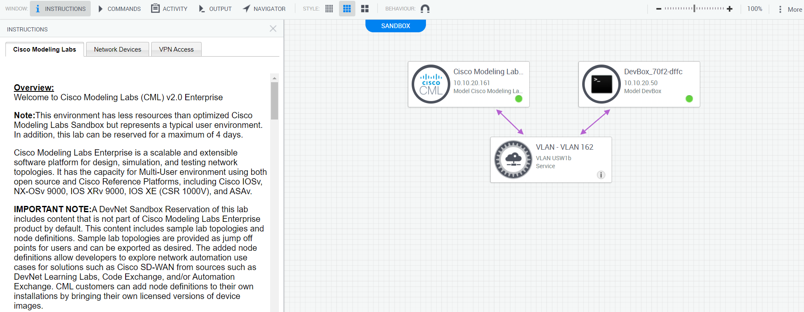
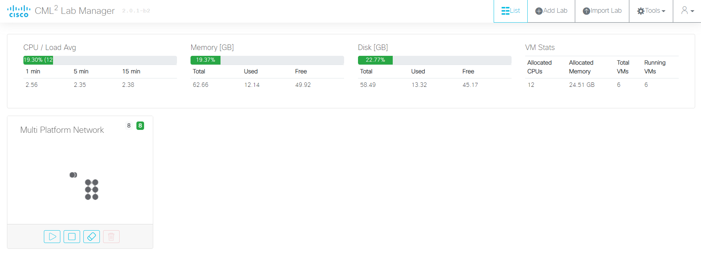
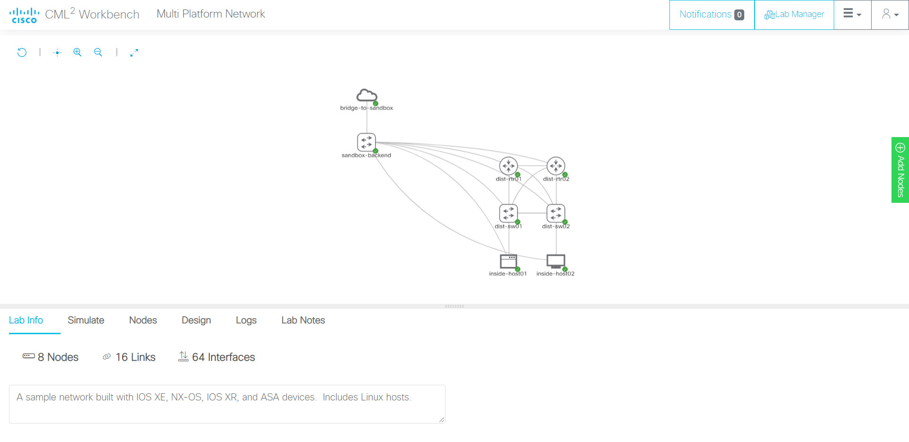
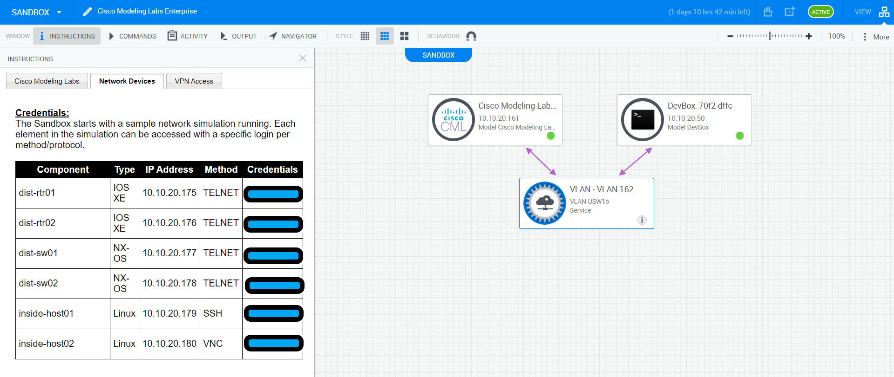
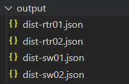

This post talks about using a Cisco DevNet sandbox lab to play with a Python library like NAPALM to create basic inventory files that describe network devices.

# DevNet sandbox

Cisco has created this great platform for learning, called the [DevNet sandbox](https://devnetsandbox.cisco.com/). There are multiple lab setups on this platform that you can spin up to practice with multiple technologies such as ACI, DNA Center, NX-OS/IOS-XE on device programmability using NETCONF/RESTCONF, etc. For this exercise of my own to set up a virtual sandbox lab and interact with it using a Python library, I am creating a Cisco Modeling Labs Enterprise sandbox.

## Setting up this lab

On DevNet sandbox, you will need to reserve the CML lab for a fixed amount of time.



Upon reservation, Cisco will send you information via email on how to be ready to use the lab from your local system as the lab is being set up. To use this lab, you will need to use Cisco's AnyConnect Mobility Client as a VPN client. This client will be used to access the lab's private VPN connection.

Once the steps of being connected to the lab via a VPN connection is complete, you can interact with the network devices set up in the lab via SSH/Telnet.

## What is in the lab

Once the lab is set up on DevNet sandbox, you can see the following topology of virtual machine instances set up by Cisco:



The lab includes:

- CML instance: A Cisco Modeling Labs instance. This is a virtual instance of a CML server which can host multiple projects. These projects can hold Cisco network devices and virtual machines set up, which can be configured and connected with each other as if it were a real network device.
On the instructions section of the sandbox, the URL to access the CML instance (which is a web console application) can be seen, with related credentials to log into CML. Visit the URL and after logging in, you should see a web interface like this



On the home page you can see a CML lab called "Multi Platform Network". On opening the lab, a topology of network devices can be viewed:



- DevBox instance: This is a CentOS virtual machine from which automation and network programmability scripts can be run to interact with network devices. This CentOS VM has a virtual environment set up within the box, which is loaded with software packages and tooling you may need to practice with, such as pyang, pyats, genie, netmiko, etc. This will be the machine we use to run our script to create a small inventory.

# Let's talk code

The goal of what we want to achieve is to create some device specific inventory files. These files should describe the device in a way that gives some specific information that would otherwise need to be obtained from the device from the CLI. This approach that we take to represent our infrastructre in a way that can be represented and consumed by code is known as Infrastructure as Code.

## Input and output

Here we assume that we have access to the list of IP addresses on which the network devices are reachable at (management IP addresses). Using these IP addresses as input to our script, we want to create device specific [JSON](https://developer.mozilla.org/en-US/docs/Learn/JavaScript/Objects/JSON) files that give us information about the device in key-value pairs.

The device specific information I want my script to scrape and store is:

- Vendor/Manufacturer of the device
- OS version
- Serial number of the device
- Device hostname, FQDN
- List of interfaces: With each interface having information such as MAC address, IP address, description, speed
- ARP table

There is a lot of more information that can be scraped from the device via such a script. I will be using an open source Python library called [NAPALM](https://napalm.readthedocs.io/en/latest/) to gather information from the device to store in specific device inventory files. NAPALM has a construct called a device driver that allows a developer to open an SSH/Telnet connection to the device and execute specific commands on the device via the driver methods.

## NAPALM

An example of how NAPALM drivers work is shown below. Firstly, on the DevBox instance (after logging into the box via SSH, `ssh -oKexAlgorithms=+diffie-hellman-group-exchange-sha1 developer@<DevBox IP address>`), you will need to install NAPALM in the virtual environment that the sandbox has created for us.

> NOTE: Get the login information for the DevBox from the "Cisco Modeling Labs" under the instructions window from sandbox, and also login information for the network devices from the "Network Devices" window

```
(py3venv) [developer@devbox ~]$ pip install napalm
Collecting napalm
  Downloading napalm-3.2.0-py2.py3-none-any.whl (230 kB)
     |################################| 230 kB 1.0 MB/s
Requirement already satisfied: netmiko>=3.1.0 in ./py3venv/lib/python3.6/site-packages (from napalm) (3.1.1)
... (truncated)
Successfully installed ciscoconfparse-1.5.28 colorama-0.4.4 dnspython-2.1.0 junos-eznc-2.5.4 napalm-3.2.0 passlib-1.7.4 pyeapi-0.8.4 pyparsing-2.4.7 transitions-0.8.6 yamlordereddictloader-0.4.0
WARNING: You are using pip version 20.1.1; however, version 21.0 is available.
You should consider upgrading via the '/home/developer/py3venv/bin/python3.6 -m pip install --upgrade pip' command.
(py3venv) [developer@devbox ~]$
```

Open a Python shell to play with one of the devices to see what NAPALM tells us about the device. Below I show a snippet of how to use NAPALM

```
(py3venv) [developer@devbox ~]$ python
Python 3.6.8 (default, Sep 14 2019, 14:33:46)
[GCC 4.8.5 20150623 (Red Hat 4.8.5-36)] on linux
Type "help", "copyright", "credits" or "license" for more information.
>>> from napalm.base import get_network_driver
>>> driver = get_network_driver("ios") # a driver holds methods that speak to the device
>>> device = driver("<DEVICE_IP_ADDRESS>", "<USERNAME>", "<PASSWORD>") # create a device driver object
>>> device.open() # open connection
>>> device.get_facts() # get some facts about the device
{'uptime': 47220, 'vendor': 'Cisco', 'os_version': 'Virtual XE Software (X86_64_LINUX_IOSD-UNIVERSALK9-M), Version 16.11.1b, RELEASE SOFTWARE (fc2)', 'serial_number': '9WAAUDHBYWK', 'model': 'CSR1000V', 'hostname': 'dist-rtr01', 'fqdn': 'dist-rtr01.virl.info', 'interface_list': ['GigabitEthernet1', 'GigabitEthernet2', 'GigabitEthernet3', 'GigabitEthernet4', 'GigabitEthernet5', 'GigabitEthernet6', 'Loopback0']}
>>>
```

In the above snippet, it is easy to see that is pretty straightforward to get some details from the device programmatically. It is required to know the OS platform of the device (`ios` in the above case), the device IP address, and login information to the device to create a device driver object which can grab pieces of information from the device.

## The script

I use VS Code as my code editor heavily for my development purposes, hence I shall be using the Remote SSH extension on VS Code to develop on the DevBox. Find information this extension on VS Code [here](https://code.visualstudio.com/docs/remote/ssh).

First off, let us make a file with the IP addresses of our network host devices in our site. On the sandbox lab, you can get this information in the "Network Devices" section under the Instructions window.



I created a directory in the home directory of my DevBox called `script/`, and within that created a file called `inventory`. The contents of inventory should hold your network device IP addresses (like this below):

```
10.10.20.175
10.10.20.176
10.10.20.177
10.10.20.178
```

Now finally, we have a basis to start writing our code. In the `script/` folder itself, create a folder named `output/`, and a file called `generate_device_info.py`. Below is the script on how I create my inventory files:

```
import json

from napalm.base import get_network_driver
from netmiko.ssh_autodetect import SSHDetect

# Mapping the netmiko type that is returned by SSH autodetect functionality by netmiko
NETMIKO_OS_TO_DRIVER_MAP = {
    "cisco_ios": "ios",
    "cisco_nxos": "nxos_ssh"
}

def main():
    """ main method that runs when the script is executed from cmdline """

    # get device IP addresses
    print(f"START: get device IP addresses from file")
    f = open("inventory", "r") # open inventory file in read mode
    devices = f.read().split("\n") # get a list of devices from the inventory file, split by new line

    # iterate through list of devices
    for device_ip in devices:

        # firstly guess the OS platform on the device, using ssh autodetect from netmiko
        print(f"{device_ip}: GUESSING OS PLATFORM")
        remote_device = {
            "device_type": "autodetect",
            "host": device_ip,
            "username": "<USERNAME STRING>",
            "password": "<PASSWORD STRING>",
        }
        guesser = SSHDetect(**remote_device)
        netmiko_guessed_os = guesser.autodetect()

        # get NAPALM driver name from MAPPER dict created above
        print(f"{device_ip}: GET NAPALM DRIVER NAME FROM NETMIKO GUESSED OS PLATFORM")
        driver_name = NETMIKO_OS_TO_DRIVER_MAP.get(netmiko_guessed_os, None)
        if not driver_name:
            print(f"{device_ip}: NETMIKO GUESSED OS PLATFORM DOES NOT MAP TO A NAPALM DRIVER")
            # if the OS type does not exist in the mapper dict, which means driver_name is None
            raise RuntimeError(f"{device_ip}: Netmiko guessed OS is not present in the mapper dict")

        # now the NAPALM stuff
        # example: IOS driver, https://github.com/napalm-automation/napalm/blob/develop/napalm/ios/ios.py
        print(f"{device_ip}: USING NAPALM DRIVER TO CONNECT TO THE DEVICE")
        driver = get_network_driver(driver_name)
        device = driver(
            device_ip, "<USERNAME STRING>", "<PASSWORD STRING>"
        )
        device.open()
        print(f"{device_ip}: SSH CONNECTION OPENED")
        print(f"{device_ip}: GETTING DEVICE FACTS")
        facts = device.get_facts() # get facts about device
        print(f"{device_ip}: GETTING DEVICE INTERFACES")
        interfaces_facts = device.get_interfaces() # get interfaces
        print(f"{device_ip}: GETTING DEVICE INTERFACES AND RELATED IP ADDRESSES")
        interfaces_ip = device.get_interfaces_ip() # get interface IP addresses (v4 and v6)
        print(f"{device_ip}: GETTING DEVICE ARP TABLE ENTRIES")
        arp_table = device.get_arp_table()

        # create an output data structure (dictionary) with relevant details
        output_dict = {
            "hostname": facts["hostname"],
            "vendor": facts["vendor"],
            "hardware_model": facts["model"],
            "operating_system": facts["os_version"],
            "serial": facts["serial_number"],
            "arp_table_entries": arp_table,
            "interfaces": {}
        }

        # loop through interface list
        for interface in facts["interface_list"]:
            intf_entry = {
                "description": interfaces_facts[interface]["description"],
                "mac_addr": interfaces_facts[interface]["mac_address"],
                "ip_addr": interfaces_ip[interface].get("ipv4", "") if interface in interfaces_ip else "No IP address configured",
                "speed": f"{interfaces_facts[interface]['speed']} Mbps",
            } # an entry with interface information

            # add that interface information to output data structure
            output_dict["interfaces"][interface] = intf_entry

        print(f"{device_ip}: DEVICE INFORMATION GATHERED")
        # write device information we wanted to capture into JSON file for specific device.
        fw = open(f"output/{facts['hostname']}.json", "w")
        print(f"{device_ip}: CREATING DEVICE SUMMARY IN JSON, FIND IT AT output/{facts['hostname']}.json")
        json.dump(output_dict, fw, indent=4)

if __name__ == "__main__":
    main()
```

Here is what the script does:

- Collect IP addresses of hosts from the input file
- Guess operating system running on the device by using the [`SSHDetect.autodetect` method](https://github.com/ktbyers/netmiko/blob/develop/netmiko/ssh_autodetect.py) from netmiko
- From the guessed OS, use the appropriate NAPALM driver to create a device driver object
- Use the device driver object's methods to get various details from the device about itself, the interfaces on it, and the ARP table entries
- Create an output dictionary that represents the data to create the inventory entry for the device
- Create an output file that holds information about the device in JSON

Execute the script by running `python generate_device_info.py`. The script prints some debug statements so you can see what is happening in the script. The `output/` folder should exist in the same folder as the script file.

There is a lot more information that a NAPALM device driver can obtain from a network device. For devices powered by Cisco IOS/IOS-XE, the available methods can be found under the `IOSDriver` class. Find the IOS driver [here](https://github.com/napalm-automation/napalm/blob/develop/napalm/ios/ios.py). Similarly, NAPALM also has drivers for IOS-XR, NX-OS, Juniper JunOS, and Arista EOS.

## Output files

Once the script has executed successfully, each device has a JSON file created to hold its respective details



These JSON files will hold the information about the device as the script created it. The script merely dumped a JSONified output of the output dictionary the script generated. It looks something like this:

```
{
    "hostname": "dist-rtr01",
    "vendor": "Cisco",
    "hardware_model": "CSR1000V",
    "operating_system": "Virtual XE Software (X86_64_LINUX_IOSD-UNIVERSALK9-M), Version 16.11.1b, RELEASE SOFTWARE (fc2)",
    "serial": "9WAAUDHBYWK",
    "arp_table_entries": [
        {
            "interface": "GigabitEthernet4",
            "mac": "52:54:00:0C:F9:7E",
            "ip": "172.16.252.1",
            "age": 10.0
        },
        ... (truncated)
    ],
    "interfaces": {
        "GigabitEthernet1": {
            "description": "to port6.sandbox-backend",
            "mac_addr": "52:54:00:0C:85:EF",
            "ip_addr": {
                "10.10.20.175": {
                    "prefix_length": 24
                }
            },
            "speed": "1000 Mbps"
        },
        "GigabitEthernet2": {
            "description": "L3 Link to core-rtr01",
            "mac_addr": "52:54:00:03:A3:94",
            "ip_addr": {
                "172.16.252.21": {
                    "prefix_length": 30
                }
            },
            "speed": "1000 Mbps"
        },
        ... (truncated)
        "Loopback0": {
            "description": "to",
            "mac_addr": "",
            "ip_addr": "No IP address configured",
            "speed": "8000 Mbps"
        }
    }
}
```

# What is the use of gathering device data as JSON data?

There are some advantages to gathering device data in a programmatic manner, even if it is gathering the raw running configuration as a .cfg file. For starters, these files can be tracked on version control to take full advantage of change management in terms of Git commits. SCM (Source Control Management) tools such as GitHub allow you to create CI/CD pipelines that can run verification jobs to ensure that changes made to these config files are conforming to a company standard.

JSON data is specifically helpful for readability purposes, and mainly for API consumption. Open source inventory management systems such as NetBox allow you to create API endpoints that can consume such JSON data to create resources on NetBox such as devices, IP address/prefixes entries, circuits, etc. As JSON is a widely used notation to store information, it can be in multiple other software contexts as well.