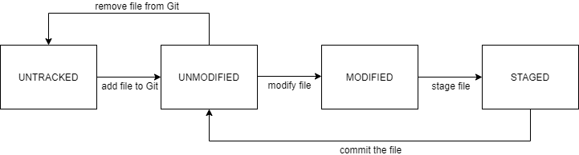
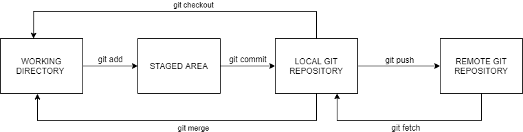

This post intends to cover basic information around software version control using a tool called Git.

# What is software version control?

In the world of open source (and proprietary) software, version control is an important aspect of tracking different software releases or rollouts to interested stakeholders. These stakeholders could be users of the software, contributors, or even those with business interests in the software or product(s) involved. Each software release comes bundled with features, improvements to existing code, or bug fixes. For instance, an initial version of a shopping cart application (say version 1.0, or v1.0) could be a simple app that allows for the user to enter the names of the products they are buying at the supermarket during checkout. The next version, say v2.0, could have a feature that allows users to use a bar code scanner at checkout to add the items they are buying to their cart.

Another important aspect of version control is how it allows multiple software developers make their code changes individually, and allows them to merge their changes together into the main code base. In the days of old, developers that were working on a project would have to notify others about the individual changes they made to a file(s) via email, or worse, by the spoken word (yikes). Version control systems have provisions in place that allow for a smoother way for a team of developers to collaborate on a project.

Let us take a look at Git, a well known software version control system.

# Git

Git is a tool that developers use for version control, and for coordinating their individual contributions to the code base that is usually stored in a remote location like a remote server. This tool can also be used for tracking changes made to your local folder and the files within them, allowing you to rollback to a previous version of those files.

To know more about Git in a detailed manner, here is the [Wikipedia page](https://en.wikipedia.org/wiki/Git).

# Great, now what exactly does Git do? How does it work?

In short words, Git tracks the changes made to your software project. A software project would have multiple files and sub-folders within it, which can be really difficult to track manually. So instead, we can allow Git to track and monitor all changes made to files and sub-folders in a project repository.

Git is a simple being. It tracks 3 structures of data to understand what is happening on a software developer's local software project. These 3 structures are:

- Working directory: The collection of files in your project. This can be text files, images, or whatever else is in your project folder, **that is on your computer memory**.
- Staging area: This is an intermediary storage that holds items or files that have been changed, and are ready to be synchronised with the current version of the project as known to Git.
- Local repository (also known as HEAD): The current version of the project as known to Git. HEAD is a label given by Git to the current version or "state" of the project repository as known to Git.

Here it is important to note that Git allows you to make changes to your files without *locking* or **committing** them to the version of your project known to Git. This will make more sense below, where the stages of the file lifecycle as seen by Git is described.

## Git file status lifecycle

The files in your project can be seen by Git in following states:

- Untracked: This is the default state of a newly created file in your project. An untracked file can be considered invisible to Git.
- Unmodified: An unmodified file is currently being tracked by Git, but it does not notice any changes made to said file.
- Modified: A file tracked by Git is in the modified state when there are changes made to the file in the working directory (on disk) that are not yet placed into the staging area.
- Staged: A file moves from the modified state to the staged state when changes made on disk are placed into the staging area. Files in the staged state are ready to be **committed**.

## What does commit mean?

The above image describes the flow between the different states of the file through its life cycle as seen by Git. The act of committing a file in Git means that the developer wants to lock in their changes to the git local repository in the form of a git commit. This commit holds information on what changes were included in the commit, when the commit was made (a timestamp), who made the change, a commit message, and a unique commit identifier known as a commit hash.

The commits are made by individual developers are tracked in a certain sequence to give the developer information about the flow of changes that were committed to the project. The most recent commit in these sequences are labelled by a Git construct known as **branches**. Branches are extremely essential to how developers collaborate using Git. All Git projects have one **main** branch, which could be named main, or master, or something else- depending on how your Git project was initialised. On [GitHub](https://www.github.com), which is a platform where developers can host their Git projects remotely, the initial branch created is named main, or master previously. Now if a developer or a group of developers want to introduce a new feature or a bug fix to the project's files, instead of committing their changes to the files on the main branch, they can create a new branch to add their commits- so that the working version of their software project on the main branch is not interrupted or broken in any way. Their new branch commits can later be merged into the main branch.

# Awesome! How can I use Git?

Phew, now that we got the very important theoretical understanding of Git covered, we can cover the actual Git commands that can be used to maintain your software project.

Download Git on your system [here](https://git-scm.com/downloads). Make sure you can use it via your command line on Linux, Windows, or MacOS. On Windows, I would recommend to [use WSL](https://docs.microsoft.com/en-us/windows/wsl/install-win10), specifically WSL version 2 if possible. On WSL 2, I would also recommend using Ubuntu 20.04 as your choice of Linux Distribution, as it comes with Git pre-installed.

The best way I can help you understand the git commands is to describe a sample example of a developer (i.e., you) creating a Git repository and working with another developer who uses the same repository.

## Step 1: Initialize a Git repository

In this case, the developer decides to host a remote Git repository on GitHub so that there is a reliable remote repository set up for smooth collaboration between the developers. On GitHub, once logged in, create a new public repository on GitHub by following the steps outlined in [the GitHub docs](https://docs.github.com/en/free-pro-team@latest/github/getting-started-with-github/create-a-repo). Only follow the steps to create the repository.

Once the GitHub repository is created, use `git clone` to clone the created GitHub repository to your local system. On your preferred command line, go to the directory/folder you want the project folder to be created (cloned) in, and execute `git clone https://github.com/<your-username>/<repository-name>.git`. Fill in the variables in the command (represented between the `<>` characters) with your GitHub username and the GitHub repository name.

> NOTE: Alternatively you could also create a local Git repository using `git init` and link your remote GitHub repository using `git remote add`. For a Linux distro, use [man-pages](https://www.kernel.org/doc/man-pages/) on your Linux shell to understand this better, using `man git init` and `man git remote`.

## Step 2: Creates some files

Now once the Git repository is set up for the project (remotely and locally), the developer can create some files in the project to get things rolling. After working on them for some time, the developer would want to lock in those changes to the repository. Before that, the changes need to be staged.

A handy command to use here is `git status`. This command would tell you which files are untracked, which tracked files have changes that are not staged, and which files have staged changes. Initially, all files are untracked. To let Git track these files and the respective changes, use `git add <file-name>` to stage the file changes of the file `file-name`.

Once the changes are staged, they can be locked by using `git commit`. This command can be used with a `-m` flag to use the command with an inline commit message. If the command is run without the `-m` flag, a text editor (usually atom or vim on Linux) opens up, asking you to enter a commit message. This commit message is handy in providing you and other fellow developers a human readable custom message that describes what the commit changed. Enter a descriptive commit message, to describe what changes were made to what files, or what the commit did.

## Step 3: Push files to remote repository

After committing local changes, your local repository is up to date with the changes you wanted. Now, you would like another developer's contributions to your project as well. This is where a remote Git repository, hosted on a platform like GitHub or BitBucket, is great.

Firstly, your local repository needs to know where to push the changes to. In case the repository was cloned, then it knows exactly where to push those changes to. But if the repository was initialized using `git init`, then you need to inform Git about where to push changes to. Use `git remote add <name-remote> <https://github.com/<your-username>/<repository-name>.git>` to add a "remote", so that Git knows where to push or pull changes to/from. `<name-remote>` here is the name you want to give to the remote URL that is specified when adding the remote.

The default remote for a cloned repository is named `origin`. To push the `main` branch to the remote Git repository, execute `git push origin main`, to tell Git to push the commits made in the branch `main` to the remote Git repository specified by a remote variable called `origin`.

## Step 4: Other developer pulls in the changes

After this, another developer has to make their changes to the project. On GitHub, a feature called **forking** needs to be used to contribute to open source projects **that they do not have push access to**. Forking allows a contributor to create their personal copy of the remote repository. Learn about forking [here](https://docs.github.com/en/free-pro-team@latest/github/getting-started-with-github/fork-a-repo).

Firstly, this developer needs to clone the forked remote repository on their local system. After this, the remote for the local repository for the forked project needs to point to the original remote project. Add remote by using `git remote add origin <https://github.com/<your-username>/<repository-name>.git>` where the username is the username of the first developer, under whose profile the project is hosted. In case the developer cloned an earlier version of the repository earlier (before the first developer pushed their changes), then the developer needs to use `git pull` first to fetch and merge the latest changes made to the remote repository (what the developer pulls in along with the changes to files, are changes to what is known as the references/refs, which are the commits the remote repository branch labels are pointing at). A `git pull` is actually the combination of `git fetch`, which fetches the remote refs, and `git merge` which merges the remote branch changes with the local branch changes.

## Step 5: Other developer makes their changes

The other developer wants to make changes to the files created/edited by the first developer, but does not want to overwrite what is there in the main branch. So what this developer can do, is create their own branch. When a developer creates a new branch, it means the commits made by the developer in this branch do not touch the version of the files in other branches. As mentioned before, a branch is a label to denote the last commit in a sequence of commits- branching allows a sequence of commits to fork out, or branch from a parent commit which is/was the most recent commit of another branch.

A branch can be created by executing `git branch <new-branch>`. This will merely create the branch, to switch to this branch after creating it, execute `git checkout <new-branch>`. `git checkout -b <new-branch>` combines both of these commands to create a new branch and switch to it.

> NOTE: You cannot checkout to a new branch unless changes made in the branch you are currently in are not committed or stashed. Explore what stashing is by executing `man git stash`.

In this new branch, the developer can make their changes, stage them, and commit them. When pushing, the developer needs to push in the new refs created for the new branch they created. So, execute `git push -u origin <new-branch>`, where the `-u` flag specifies to set an upstream for this branch to track from.

## Step 6: Other developer wants to merge their changes to the main branch

Now that the new branch has been pushed to remote, the second developer may want to merge in their changes to the main branch. To get this done on a platform like GitHub, they have to create a **pull request**. To summarize everything I have covered here and more, find the full flow of creating pull requests [here](https://www.digitalocean.com/community/tutorials/how-to-create-a-pull-request-on-github)
