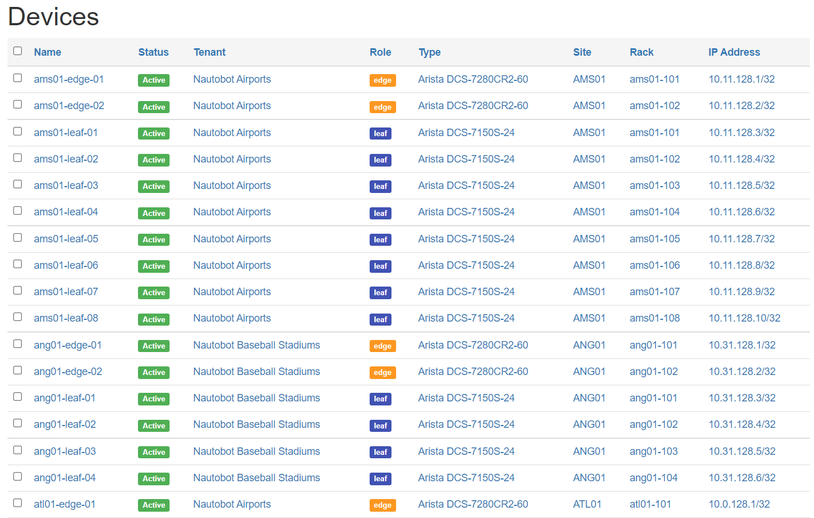
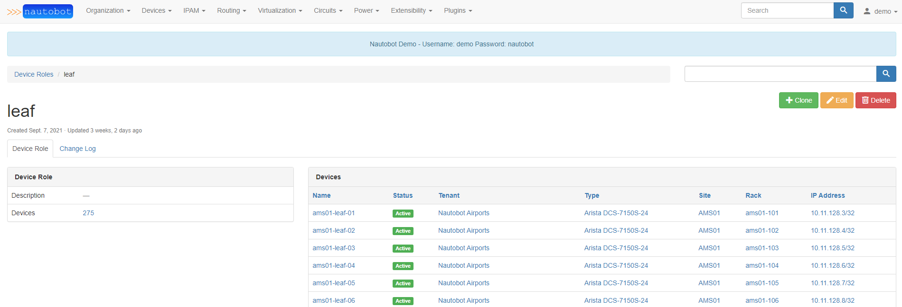

# Maintaining data for network automation

When I hear the term "Infrastructure as Code" I am reminded of the times where most people talk about representing computer infrastructure in YAML or JSON data. While that is one piece of the whole story, software is capable of much more in today's world of web applications. This is where the topic of data maintainance in infra as code gets super interesting, and where we notice that *automating networks/infrastructure is not only about the technology, but also hugely about the data it uses to automate*.

## Source of Truth

A source of truth (SoT) by virtue of its name represents a place from which the "truth" for something can be sourced! Beyond these 3 words, an SoT in a network is where one can

- model the state of the network
- model the relations between various objects in the network
- create new objects that are about to introduced in the network using automation

to name a few uses of an SoT.

To keep this simple, I will be referencing SoTs as web applications that work with some sort of a database to store information- although in the past or even now, there may be a lot of information that is stored in Excel sheets or even Notepad files.

In an SoT, engineers can maintain data about the network, and keep it updated with the latest changes made in the network. Ideally, in an automation only world, engineers would make changes to the SoT and kick off an automated process that they have helped develop to make the changes in the network for them. In the former case, the SoT is stored with data that production the network already contains- whereas in the latter, the data in the SoT is used as the "intended network state" based upon which the network is refactored.
*The latter is what network automation must strive to become*, as it does not involve running after data that is already being used in production systems- one can always merely revert the changes in the SoT and deploy the intended state as it was in case of incidents due to bad configs!

## Metadata in the SoT

While keeping data about real infrastructure in the network is fairly straightforward- certain standards surrounding the data about the infrastructure must be maintained by the engineers making real changes in the network and the SoT during change windows, AND the code that powers the automation systems. *Automation cannot be effective unless it knows what it can expect from the SoT*. Based on prior experience, let me try to paint a picture.

> Images below are from Network to Code's Demo Nautobot instance

[Nautobot](https://nautobot.readthedocs.io/en/stable/) is one such SoT application, and say there are some devices in Nautobot



If you notice, these devices have a `Role` assigned to them such as `edge`, `leaf`, etc. This is a good example of metadata for a device, as it does not represent physical objects, but rather the function of the device in the network.

For leaf devices in the network, there is a specific role



Based on this data, say there is an Ansible project that uses this Nautobot instance as an inventory. So there may be some Ansible inventory groups created to represent multiple hosts playbooks can run against- for example, let's say there is an Ansible group named `device_role__leaf` to represent all devices that have a device role of leaf.

Usually with an SoT, the Ansible inventory is ideally built for every playbook run via an inventory plugin (unless the inventory is statically maintained, which would invalidate the need for an SoT). There may be a playbook to run some changes for leaf devices only:

```yaml
---

- name: example playbook
  hosts: device_role__leaf
  connection: network_cli
  gather_facts: no

  tasks:
  ... (tasks to do some work)
```

Alongside these playbooks, there may also be some Python scripts/projects that interact with the SoT to do some work with network devices using your favorite Python network libraries such as [netmiko](http://ktbyers.github.io/netmiko/) or [scrapli](https://carlmontanari.github.io/scrapli/)! These also probably use some automation framework like Nornir to run tasks in an efficient manner against your leaf devices- so there may be some reference to the device role name in these Python files to get/set device info based on the device role `leaf`

```python
# using pynautobot: https://github.com/nautobot/pynautobot
import pynautobot
nautobot = pynautobot.api(
    url="http://nautobot.example",
    token="abc123",
)
devices = nautobot.dcim.devices
leaf_devices = devices.get(device_role="leaf") # hope this would work!
```

Awesome! You got all this working. Now say the `leaf` device role is changed and named `toe` or something. Once this is done, your playbooks and tools built atop the Source of Truth stop working, and automation stops - and unfortunately standards are lost somewhere or the other.

## Automation and standards go hand in hand

I guess the point of this post is to highlight that networking standards and automation need to go hand in hand. When it comes to a big networking team working with thousands of devices, automation is a boon, but *the lack of communication and efforts to standardize data will turn that boon into a blocker* for the most innovative ventures in the network.

Network automation works the best when:

1) it knows what to expect when it attempts to automate operational workflows
2) the engineers working with the automation workflows understand how to use them in the best possible manner

Even if you don't write code to automate networks, you as a network engineer implementing and setting standards in the network are still a huge piece of the automation pipeline!
