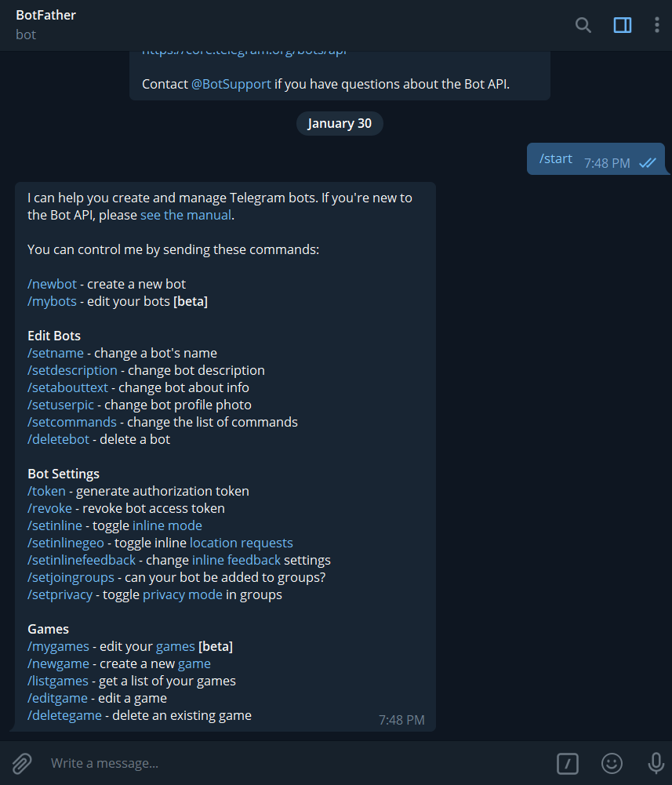
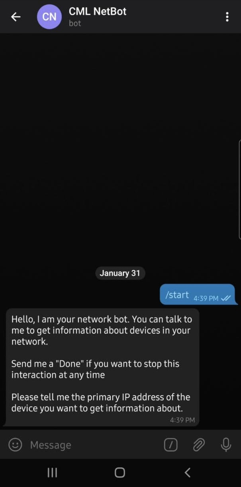
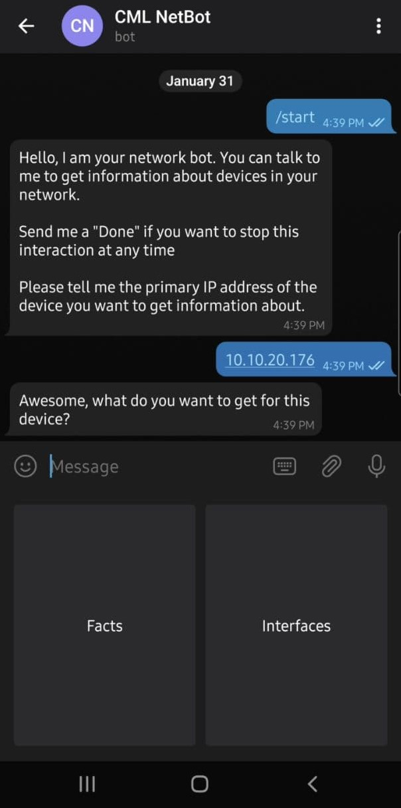
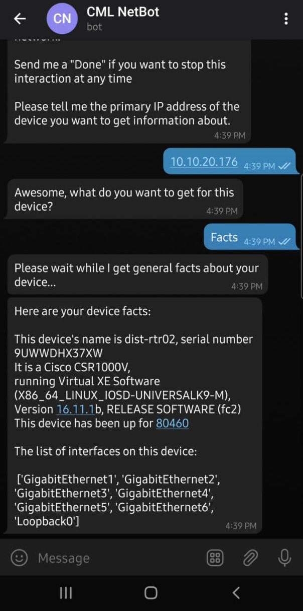
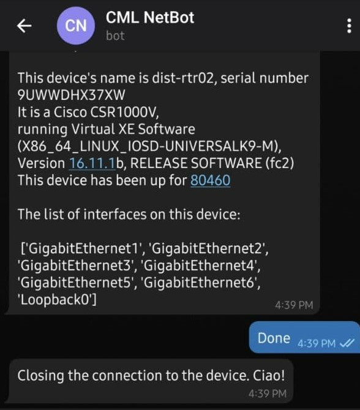

This post runs through the making of a simple chat bot on [Telegram](https://telegram.org/) that has the ability to get information from network devices using [NAPALM](https://napalm.readthedocs.io/en/latest/) and display such information in form of chat messages.

# The chatbot

In simple terms, a chat bot is an interface that a user communicates with to either get information, or to kick off some automated job that makes their life easier. In the case covered in this post, I wanted to explore the possibility of provisioning a bot that could tell me stuff about the devices in my network.

In the simplest of designs, there are 3 contention points that need to be glued together here:

- Your network devices need to be reachable from the server code running your automated processes
- The server hosting the code that powers the bot needs to be authorized to use the messaging API, in this case, the Telegram API
- The bot's front end interface, i.e., the messaging application, needs to be able to receive and display information and messages sent by the automated processes running on the server.

In the case of Telegram, we do not need to worry about how to Telegram API receives and displays messages on their applications, as specified on their [API information page](https://core.telegram.org/api):

> To use the Telegram API, you don't need to know anything about how our MTProto encryption protocol works — our intermediary server will handle all encryption and communication with the Telegram API for you. You communicate with this server via a simple HTTPS-interface that offers a simplified version of the Telegram API.

Solid! So all we should care about is writing our server code and making sure it can talk to the network devices you want to interface with, and the Telegram API which powers the bot.

# Defining the chatbot I wanted

I wanted to build something simple that could just get some basic facts about a device through a chat interaction. It should be straightforward, with a defined path of steps that the chatbot takes to communicate with the user. These are the steps of the lifecycle that I defined for the chatbot:

1. Start the communication process: User kicks off the chat with the bot with a message or a button click. The bot asks the user the primary IP address of the device that the user wants information about.
2. User provides the device IP address: After this, the bot asks the user what kind of information the user wants from the device. I merely created two options that the user can select here- facts and interfaces.
3. The bot knows what to do: Now that the user has selected what they want, the bot now provides a "Please Wait" status update to the user while it does the work of fetching required information from the device. This work in the background is performed by the server which talks with the network device.
4. The bot reports back with the information: After the application running on the server gathers the required information from the network device, it presents back that information in a format that is easy to read in a chat message, or in multiple messages.
5. User closes the connection: When the user is done with their work on the chatbot, the user issues a command to end the context of the conversation.

Now that the story of the chatbot is defined, the writing of the code that powers the bot becomes a bit easier.

# Powering my chatbot

The reason why I wanted to make this on Telegram is because it has amazing support around the API, coming with an open source SDK and multiple other community driven tools that make it straightforward for a developer to concentrate on what the bot should do, rather than break their head over how things work under the hood.

Firstly to create the bot, I reached out to the [BotFather](https://telegram.me/botfather) on my Telegram application (I don't think you could have a better name for a bot!). The BotFather functionality on Telegram is freaking awesome! It is a bot that allows you to create, edit, and delete bots that you want to develop. Using this functionality you can generate API tokens for your bots, handle the commands and help text that the bot can provide to a user, and much much more. I seriously cannot stress more on how impressive I found this functionality to be. :)



After creating the most plain of bots (with no commands set, I just needed an API token), I started off on making my server program that would power the bot. Using my local PC as a bot server, I created a virtual environment on my [WSL](https://docs.microsoft.com/en-us/windows/wsl/install-win10) environment with the following packages installed, which the bot server application needs to use:

- [python-telegram-bot](https://python-telegram-bot.readthedocs.io/en/stable/)
- [NAPALM](https://napalm.readthedocs.io/en/latest/)

Installing these two packages via pip ensures that any other required packages that the bot server application may need is also installed as dependencies (such as [netmiko](http://ktbyers.github.io/netmiko/)).

The `python-telegram-bot` module is a very interesting software package, or SDK. It acts as a *Pythonic* interface to the Telegram API, through which the bot can be controlled. I would highly, highly recommend going through the examples of the sample bots that are described in their GitHub repository. You can find them [here](https://github.com/python-telegram-bot/python-telegram-bot/tree/master/examples).

As such, this SDK is really verbose in what it can do. But for my bot, I only wanted basic text interactions between the bot and the user. Through the construct of multiple classes that are part of this SDK, I could create my Python script that would power my server application.

- `telegram.ext.Updater`: The `Updater` class allows programmatic access to the bot interface on the messaging platform. This class contains the functionality of dispatchers, which are used to "dispatch" **handlers** on the bot interface that allow the developer to define the lifecycle of the bot and how the bot reacts to user messages.
- `telegram.ext.ConversationHandler`: The `ConversationHandler` class allows the developer to define the different stages of the conversation and the actions that need to be taken by the bot on each step.
- `telegram.ext.CommandHandler`: The `CommandHandler` class allows the developer to define what action must be taken by the bot when the user triggers a certain command in the chat.

Now that I have outlined the constructs in the SDK that I used to make my bot server application, I can define the steps that would be defined in my `ConversationHandler`:

1. Start: This is the entry point of the bot conversation lifecycle. User provides the primary IP address of the device.

    

2. Choose: User chooses what information they want from the device.

    

3. Run choice: Whatever is selected by the user, run the process required to get that information and return information back to the user in a chat friendly way.

    

4. End: Triggered on user command of "Done" or "done". Clear out user data and end conversation.

    

# A look into the server code itself

Here are snippets of the steps I wrote for my bot actions. Note that here `update` and `context` are variables used in step methods to keep track of user message updates and context variables that describe the context of the conversation, respectively.

1. Start
    ```
    def start(update: Update, context: CallbackContext) -> int:
        """ The start to the conversation """
        update.message.reply_text(
            'Hello, I am your network bot. You can talk to me to get information about devices in your network.\n\n'
            'Send me a "Done" if you want to stop this interaction at any time\n\n'
            'Please tell me the primary IP address of the device you want to get information about.',
        )

        return CHOOSE
    ```

2. Choose

    ```
    def choose_option(update: Update, context: CallbackContext) -> int:
        reply_keyboard = [['Facts', 'Interfaces']]
        context.user_data['ipaddr'] = update.message.text
        update.message.reply_text(
            'Awesome, what do you want to get for this device?',
            reply_markup= ReplyKeyboardMarkup(reply_keyboard, one_time_keyboard=True)
        )

        return CHOICE
    ```

3. Run choice selected

    ```
    def choice_wrapper(update: Update, context: CallbackContext) -> int:
        text = update.message.text
        ip_addr = context.user_data['ipaddr']
        if text == 'Facts':
            update.message.reply_text("Please wait while I get general facts about your device...")
            device_facts = get_device_facts(ip_addr) # uses NAPALM, this is a wrapper around that.

            if not device_facts:
                update.message.reply_text("Sorry, this device type is not supported yet.")

            else:
                update.message.reply_text(
                    'Here are your device facts:\n\n'
                    f'This device\'s name is {str(device_facts["hostname"])}, serial number {str(device_facts["serial_number"])}\n'
                    f'It is a {str(device_facts["vendor"])} {str(device_facts["model"])}, running {str(device_facts["os_version"])} \n'
                    f'This device has been up for {str(device_facts["uptime"])}\n\n'
                    f'The list of interfaces on this device:\n\n {str(device_facts["interface_list"])}'
                )

        if text == 'Interfaces':
            update.message.reply_text("Please wait while I get information about working interfaces on your device...")
            device_interfaces = get_device_interfaces(ip_addr) # uses NAPALM, this is a wrapper around that.

            if not device_interfaces:
                update.message.reply_text("Sorry, this device type is not supported yet.")

            else:
                update.message.reply_text('Here are facts about your device interfaces:\n\n')

                for d in device_interfaces:
                    if device_interfaces[d]['is_up'] and device_interfaces[d]['is_enabled']:
                        update.message.reply_text(
                            f'About interface {str(d)}:\n\n'
                            f'It has a burnt in address of {device_interfaces[d]["mac_address"]}'
                            f'And supports a speed of {device_interfaces[d]["speed"]} Mbps, with an MTU of {device_interfaces[d]["mtu"]}'
                        )

        return DONE
    ```

4. End

    ```
    def done(update: Update, context: CallbackContext) -> int:
        user_data = context.user_data
        if 'ipaddr' in user_data:
            del user_data['ipaddr']

        update.message.reply_text(
            f"Closing the connection to the device. Ciao!"
        )

        user_data.clear()
        return ConversationHandler.END
    ```

And the `main` function that runs the show:

    ```
    CHOOSE, CHOICE, DONE = range(3) # Three numbered states the chatbot resides at after communication has started.
    def main():
        updater = Updater("YOUR-TELEGRAM-API-TOKEN", use_context=True) # provides the interface to the bot
        dispatcher = updater.dispatcher
        convo_handler = ConversationHandler(
            entry_points= [CommandHandler('start', start)],
            states= {
                CHOOSE: [MessageHandler(Filters.regex("^(\d{1,3}\.){3}\d{1,3}$"), choose_option)],
                CHOICE: [MessageHandler(Filters.regex('^(Facts|Interfaces)$'), choice_wrapper)],
                DONE: [MessageHandler(Filters.regex('^[dD]one$'), done)]
            },
            fallbacks=[MessageHandler(Filters.regex('^[dD]one$'), done)],
        )
        dispatcher.add_handler(convo_handler) # Dispatch the conversation handler object to the bot interface.

        # Start the Bot
        updater.start_polling() # Start polling the bot interface to check for any new messages.

        # Run the bot until you press Ctrl-C or the process receives SIGINT,
        # SIGTERM or SIGABRT. This should be used most of the time, since
        # start_polling() is non-blocking and will stop the bot gracefully.
        updater.idle() # keep bot interfacing till process is stopped...
    ```

And to allow the server application to be run via Python on the command line:

    ```
    if __name__ == "__main__":
        main()
    ```
