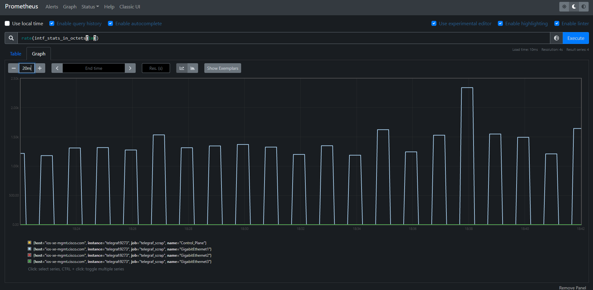
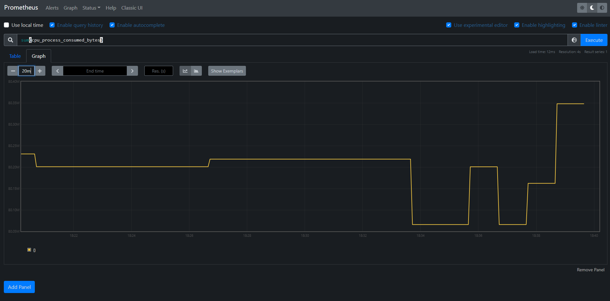

# Monitoring using NETCONF

Whilst studying for my Cisco DevNet Associate certification this year, I learnt about NETCONF and YANG models. Although I knew about both of them in theory, I never tried getting some hands on time with NETCONF or YANG as the networks I work with are mostly CLI based, where SNMP is used extensively.

So in the last few weeks as a part of my job, I was attempting to read operational data from the devices in our enterprise network using SNMP... which was a bit of a nightmare! Some of the challenges I faced were:

- Being an inexperienced engineer, I was not aware of how MIBs and the objects in MIBs could really be read from- I had to spend so much time reading from multiple places about how to poll these objects.
- **MIBs are mostly vendor specific** and there was not a straightforward way to ask a device which MIBs it supported.
- Certain MIB objects do not appear in different OS versions, so it is pretty inconsistent
- The documentation on what MIBs exist, and their structure was really difficult to find. I had to depend on obscure internet searches to find such information- this is where [this online MIB browser](https://bestmonitoringtools.com/mibdb/mibdb_search.php) came in super handy.

So being the fellow that I am, I wanted to try out an alternative to SNMP by myself, so I thought hey, why not NETCONF?

## NETCONF

NETCONF was created in order to address some shortcomings of SNMP as a network management protocol:

- SNMP does not provide a good amount of writable MIBs
- SNMP does not scale well and is inconsistent
- SNMP does not separate between config and operational data

So it was made to tackle these problems, and even more. NETCONF is implemented in a client-server mechanism, where the client performs a [Remote Procedure Call](https://en.wikipedia.org/wiki/Remote_procedure_call) request to the server to retrieve device statistics, or create/read/update/delete data related to the device configuration.

In my case I wanted to try out NETCONF for monitoring- and it made sense. NETCONF works over SSH, and uses XML encoded messages for communication over SSH. But what powers NETCONF from a user persepctive is a data model that specifies the schema of data stored on the device. One of these models is known as YANG, which I will be using in this article.

> To understand the interworking of NETCONF, please go through [this post](https://blogs.cisco.com/developer/intro-to-programmability-2)

## YANG

As mentioned in RFC 6020:

> YANG is a data modeling language used to model configuration and state data manipulated by the Network Configuration Protocol (NETCONF)

YANG is a pretty complex concept by itself- it involves multiple constructs that can be used to define data models and relationships between objects in those data models. So instead of diving into what each concept means, I will try to show an example of a YANG data model, and explain what that means. I will show [a YANG model](https://github.com/YangModels/yang/blob/master/vendor/cisco/xe/16111/Cisco-IOS-XE-memory-oper.yang) from [a repository of YANG models](https://github.com/YangModels/yang) which is a really useful place to see available YANG models.

```bash
module Cisco-IOS-XE-memory-oper {
  yang-version 1;
  namespace "http://cisco.com/ns/yang/Cisco-IOS-XE-memory-oper";
  prefix memory-ios-xe-oper;

  organization
    "Cisco Systems, Inc.";
  contact
    "Cisco Systems, Inc.
     Customer Service
     
     Postal: 170 W Tasman Drive
     San Jose, CA 95134
     
     Tel: +1 1800 553-NETS
     
     E-mail: cs-yang@cisco.com";
  description
    "This module contains a collection of YANG definitions for
     monitoring memory in a Network Element.
     Copyright (c) 2016-2017 by Cisco Systems, Inc.
     All rights reserved.";

  grouping memory-stats {
    description
      "Memory statistics";
    leaf name {
      type string;
      description
        "The name of the memory pool";
    }
    leaf total-memory {
      type uint64;
      units "bytes";
      description
        "Total memory in the pool (bytes)";
    }
    leaf used-memory {
      type uint64;
      units "bytes";
      description
        "Total used memory in the pool (bytes)";
    }
    leaf free-memory {
      type uint64;
      units "bytes";
      description
        "Total free memory in the pool (bytes)";
    }
    leaf lowest-usage {
      type uint64;
      units "bytes";
      description
        "Historical lowest memory usage (bytes)";
    }
    leaf highest-usage {
      type uint64;
      units "bytes";
      description
        "Historical highest memory usage (bytes)";
    }
  }

  container memory-statistics {
    config false;
    description
      "Data nodes for All Memory Pool Statistics.";
    list memory-statistic {
      key "name";
      description
        "The list of software memory pools in the system.";
      uses memory-ios-xe-oper:memory-stats;
    }
  }
}
```

In this model, the important parts as are follows:

- The module `Cisco-IOS-XE-memory-oper` is the highest level object, it is the name of the YANG module. Modules can be used in other modules to inherit parts of data models.
- In this module, the container `memory-statistics` is a construct that is used to define a object which contains other objects. In this case, `memory-statistics` is non-configurable, and consists of a list of memory statistic objects.
- The `memory-statistic` object is a table like construct, where the entries in the table have attributes, or `leaf` objects. Leaf objects are terminal objects of a tree, that do not have any child nodes. Leaf objects usually consist of values that hold information about the device or the configuration of the device.
- This YANG model has a namespace (a unique identifier) defined, which is required when attempting to fetch data from this data mode. In this model, the namespace is `http://cisco.com/ns/yang/Cisco-IOS-XE-memory-oper`.

Using [`pyang`](https://github.com/mbj4668/pyang), the tree structure for a YANG model can be seen- this is very handy in understanding how the data model is structured:

```bash
(venv) user@COMPUTER$ pyang -f tree Cisco-IOS-XE-memory-oper.yang
module: Cisco-IOS-XE-memory-oper
  +--ro memory-statistics
     +--ro memory-statistic* [name]
        +--ro name             string
        +--ro total-memory?    uint64
        +--ro used-memory?     uint64
        +--ro free-memory?     uint64
        +--ro lowest-usage?    uint64
        +--ro highest-usage?   uint64
```

## Using NETCONF + YANG to get data from a device

The `ncclient` Python package is a great resource for abstracting the interaction with a NETCONF server. It handles the end to end communication with the server in a simple manner to get data from configurations, get operational data, and configure the device.

In NETCONF, the `<get>` and `<get-config>` operations allow for a `filter` construct/XML tag to specify a section of the data model that you would like to retrieve. As NETCONF requires complete XML data while creating requests, this filter construct helps simplify the target for retrieval.

Using the filter tag, you can target a YANG data model that is supported by the device. Check the `hello` message sent by the device when a NETCONF session is opened to see the capabilities supported by the device, to see which YANG data models are supported.

> NOTE: To see capabilities supported by the server, just execute `ssh <username>@<server-hostname> -p <netconf-port>` from your terminal

For example, to get all names of the interfaces on a device, the RPC request to the NETCONF server would be:

```xml
<rpc xmlns="urn:ietf:params:xml:ns:netconf:base:1.0" message-id="101">
    <get>
        <filter>
            <interfaces-state xmlns="urn:ietf:params:xml:ns:yang:ietf-interfaces">
                <interface>
                    <name/>
                </interface>
            </interfaces-state>
        </filter>
    </get>
</rpc>
```

To which the reply would be:

```xml
<rpc-reply xmlns="urn:ietf:params:xml:ns:netconf:base:1.0" message-id="101">
    <data>
        <interfaces-state xmlns="urn:ietf:params:xml:ns:yang:ietf-interfaces">
            <interface>
                <name>GigabitEthernet1</name>
            </interface>
            <interface>
                <name>GigabitEthernet2</name>
            </interface>
            <interface>
                <name>GigabitEthernet3</name>
            </interface>
            <interface>
                <name>Control Plane</name>
            </interface>
        </interfaces-state>
    </data>
</rpc-reply>
```

This looks difficult to read right? `ncclient` allows you to simplify this interaction via code:

```python
from typing import Dict
from ncclient import manager
import xmltodict
import json

def main():
    with manager.connect(
        host = "10.10.20.48",  # IP address of NETCONF server
        port = 830,  # NETCONF port
        username = "developer",
        password = "",  # enter device password
        hostkey_verify=False,  # do not have SSH host key verification
        device_params = {'name': 'iosxe'}  # specify platform
    ) as m:
        # https://github.com/YangModels/yang/blob/master/vendor/cisco/xe/16111/ietf-interfaces.yang
        # Only have to specify the filter! ncclient takes care of packaging it into a `<get>` RPC request
        netconf_filter = """
        <filter xmlns="urn:ietf:params:xml:ns:netconf:base:1.0">
                <interfaces-state xmlns="urn:ietf:params:xml:ns:yang:ietf-interfaces">
                        <interface>
                                <name/>
                                <type/>
                                <oper-status/>
                                <statistics>
                                        <in-octets/>
                                        <in-errors/>
                                        <out-octets/>
                                        <out-errors/>
                                </statistics>
                        </interface>
                </interfaces-state>
        </filter>
        """

        # Make the `<get>` RPC request- this is used to get any data from the data including oper data
        # Apply the filter
        netconf_rpc_reply = m.get(
            filter = netconf_filter
        ).xml

        # Parse the XML data using xmltodict- this will create an OrderedDict object
        netconf_reply_dict = xmltodict.parse(netconf_rpc_reply)

        # Loop over interfaces retrieved, print it
        for intf_entry in rpc_reply_dict["rpc-reply"]["data"]["interfaces-state"]["interface"]:
            print(intf_entry["name"])
```

gives the result:

```bash
GigabitEthernet1
GigabitEthernet2
GigabitEthernet3
Control Plane
```

## OK now how to implement the telemetry part?

To keep this simple, I will be implementing the monitoring solution for this with 2 extra components that will grab this NETCONF data and store it in a data store:

- [Telegraf](https://docs.influxdata.com/telegraf/): Telegraf is a tool that allows you to create agents that can capture metrics and report them in many ways. Telegraf provides different types of plugins.
- [Prometheus](https://prometheus.io/docs/introduction/overview/): Prometheus is a [time series database](https://www.influxdata.com/time-series-database/), or TSDB for short. It stores data with a focus on the timestamp of the data collected- which allows for a viewing of trends in the data. Prometheus provides a query language known as [PromQL](https://prometheus.io/docs/prometheus/latest/querying/basics/)- which allows you to query and play with the data to get what you need.

The way I used these 2 tools is as follows:

- The telegraf agent will use the [`exec`](https://github.com/influxdata/telegraf/blob/release-1.19/plugins/inputs/exec/README.md) plugin to execute a script that uses `ncclient` to get NETCONF data from a device/devices
- Prometheus will scrape the data collected by Telegraf and store it in the TSDB- and it provides a Graph feature that allows you to view the data collected

Great! To package these 2 services together, I used [Docker](https://docs.docker.com/get-docker/) and [`docker-compose`](https://docs.docker.com/compose/) so that I can have both Telegraf and Prometheus do their thing, and communicate with each other **in a composite environment that can be built and run anywhere**.

I have maintained all this in my GitHub repository [here](https://github.com/anirudhkamath/monitoring-practice-with-netconf). To get this working, you will need to

- clone the repo
- Change the host/username/password to your requirements. **Currently it has the host as the IOS XE on CSR Recommended Code AlwaysOn** on [Cisco DevNet sandbox](https://devnetsandbox.cisco.com/) in the Telegraf/NETCONF related files in the `telegraf/` directory
- Run `docker-compose build` and `docker-compose up` to launch the services
- Visit the Prometheus app at `http://localhost:9090`

Here is a summary of how it works:

- The NETCONF powered script is similar to the example showed before- this repository will have 3 NETCONF scripts:

One to fetch information about number of interface octets/bytes received and sent, and the errors received/sent
```xml
<filter xmlns="urn:ietf:params:xml:ns:netconf:base:1.0">
    <interfaces-state xmlns="urn:ietf:params:xml:ns:yang:ietf-interfaces">
        <interface>
            <name/>
            <type/>
            <oper-status/>
            <statistics>
                <in-octets/>
                <in-errors/>
                <out-octets/>
                <out-errors/>
            </statistics>
        </interface>
    </interfaces-state>
</filter>
```

Bytes consumed by CPU processes on the device
```xml
<filter xmlns="urn:ietf:params:xml:ns:netconf:base:1.0">
    <memory-usage-processes xmlns="http://cisco.com/ns/yang/Cisco-IOS-XE-process-memory-oper">
        <memory-usage-process>
            <name/>
            <pid/>
            <allocated-memory/>
            <freed-memory/>
            <holding-memory/>
        </memory-usage-process>
    </memory-usage-processes>
</filter>
```

Percentage of memory consumed by the processor and I/O (used-memory divided by total-memory)
```xml
<filter xmlns="urn:ietf:params:xml:ns:netconf:base:1.0">
    <memory-statistics xmlns="http://cisco.com/ns/yang/Cisco-IOS-XE-memory-oper">
        <memory-statistic>
            <name/>
            <used-memory/>
            <total-memory/>
        </memory-statistic>
    </memory-statistics>
</filter>
```

The NETCONF scripts would have a format as such:

```python
from typing import Dict
from ncclient import manager
import xmltodict
import json

def dict_to_telegraf_json(rpc_reply_dict: Dict) -> str:
    """
    This method takes the dict received from parsing the XML RPC reply
    and returns back a JSON formatted string in a format suitable for Telegraf consumption
    https://docs.influxdata.com/telegraf/v1.19/data_formats/input/json/
    """

    # need to loop over `rpc_reply_dict`, take values in that dict
    # and form a JSON suitable data structure, like an array of dicts, or a dict with multiple keys

    return json.dumps(
        [
            {
                "test_key": "test_value"
            }
        ]
    )

def main():
    with manager.connect(
        host = "ios-xe-mgmt.cisco.com",  # sandbox ios-xe always on
        port = 10000,
        username = "developer",
        password = "",  # enter device password
        hostkey_verify=False,
        device_params = {'name': 'iosxe'}
    ) as m:
        # https://github.com/YangModels/yang/blob/master/vendor/cisco/xe/16111/ietf-interfaces.yang
        netconf_filter = """
            <<<< ADD FILTER HERE BASED ON NETCONF USE CASE >>>>
        """

        netconf_rpc_reply = m.get(
            filter = netconf_filter
        ).xml

        netconf_reply_dict = xmltodict.parse(netconf_rpc_reply)
        
        telegraf_json_input = dict_to_telegraf_json(netconf_reply_dict)

        # telegraf needs data in a certain data format.
        # I have chosen JSON data that will be picked up by the exec plugin
        print(telegraf_json_input)


if __name__ == "__main__":
    main()
```
    
> The data collected by NETCONF needs to be transformed to a format that can be consumed by Telegraf- I chose to have my NETCONF script return [the data in the JSON format accepted by Telegraf](https://github.com/influxdata/telegraf/tree/master/plugins/parsers/json)    

- The telegraf config `telegraf.conf` looks as such:

```conf
# Configuration for telegraf agent
[agent]
## Default data collection interval for all inputs
interval = "60s"
## Rounds collection interval to 'interval'
## ie, if interval="10s" then always collect on :00, :10, :20, etc.
round_interval = true

## Telegraf will send metrics to outputs in batches of at most
## metric_batch_size metrics.
## This controls the size of writes that Telegraf sends to output plugins.
metric_batch_size = 1000
hostname = "ios-xe-mgmt.cisco.com"
omit_hostname = false


#### NETCONF INTERFACES STATS COLLECTION ####

[[inputs.exec]]
## Commands array
commands = [
    "python3 /opt/monitoring/telegraf/netconf-interfaces.py"
]
json_name_key = "field"
tag_keys = [
    "name"
]
timeout = "30s"
data_format = "json"


#### NETCONF CPU FREED MEMORY STATS COLLECTION ####

[[inputs.exec]]
## Commands array
commands = [
    "python3 /opt/monitoring/telegraf/netconf-cpu.py"
]
json_name_key = "field"
tag_keys = [
    "name",
    "process_id",
]
timeout = "30s"
data_format = "json"


#### NETCONF MEMORY POOL STATS COLLECTION ####

[[inputs.exec]]
## Commands array
commands = [
    "python3 /opt/monitoring/telegraf/netconf-memory-pools.py"
]
json_name_key = "field"
tag_keys = [
    "name"
]
timeout = "30s"
data_format = "json"


# # Configuration for the Prometheus client to spawn
[[outputs.prometheus_client]]
#   ## Address to listen on
    listen = "telegraf:9273"  # refers to telegraf service in docker compose
    metric_version = 2
```

- The Prometheus config file is configured to scrape data from Telegraf:
    
```yaml
# my global config
global:
    scrape_interval:     30s # Set the scrape interval to every 15 seconds. Default is every 1 minute.
    evaluation_interval: 30s # Evaluate rules every 15 seconds. The default is every 1 minute.
    # scrape_timeout is set to the global default (10s).

# A scrape configuration containing exactly one endpoint to scrape:
# Here it's Prometheus itself.
scrape_configs:
    # The job name is added as a label `job=<job_name>` to any timeseries scraped from this config.
    - job_name: 'prometheus'

        # metrics_path defaults to '/metrics'
        # scheme defaults to 'http'.

        static_configs:
        - targets: ['localhost:9090']

    # get telegraf data from the Telegraf service
    - job_name: 'telegraf_scrap'

        static_configs:
        - targets: ['telegraf:9273']
```

To package all this and run Telegraf and Prometheus, I created Dockerfiles for both the Prometheus and Telegraf applications:
- [Dockerfile Prometheus](https://github.com/anirudhkamath/monitoring-practice-with-netconf/blob/master/Dockerfile-prometheus)
- [Dockerfile Telegraf](https://github.com/anirudhkamath/monitoring-practice-with-netconf/blob/master/Dockerfile-telegraf)

These Dockerfiles are used to build both Prometheus and Telegraf, and are invoked by [the `docker-compose` specification for the project](https://github.com/anirudhkamath/monitoring-practice-with-netconf/blob/master/docker-compose.yml)

Running all this (`docker-compose up`) you can visit the prometheus app and run the following commands to see some nice graphs!

- `rate(intf_stats_in_octets[1m])`: To get the rate of bytes entering the interfaces

    

- `sum(cpu_process_consumed_bytes)`: Total number of bytes consumed by all processes running on the IOS-XE OS

    

> Find documentation on using PromQL [here](https://prometheus.io/docs/prometheus/latest/querying/basics/)

## Helpful links

- [Telegraf plugins](https://docs.influxdata.com/telegraf/v1.19/plugins/)
- [YangModels/yang on GitHub](https://github.com/YangModels/yang/)
- [Network Configuration Protocol (NETCONF)](https://datatracker.ietf.org/doc/html/rfc6241)
- [Intro to Programmability, good example of using NETCONF](https://blogs.cisco.com/developer/intro-to-programmability-2)
- [Querying Prometheus](https://prometheus.io/docs/prometheus/latest/querying/basics/)
- [Time series database](https://www.influxdata.com/time-series-database/)
- [Remote Procedure Calls](https://www.cs.rutgers.edu/~pxk/416/notes/15-rpc.html)
